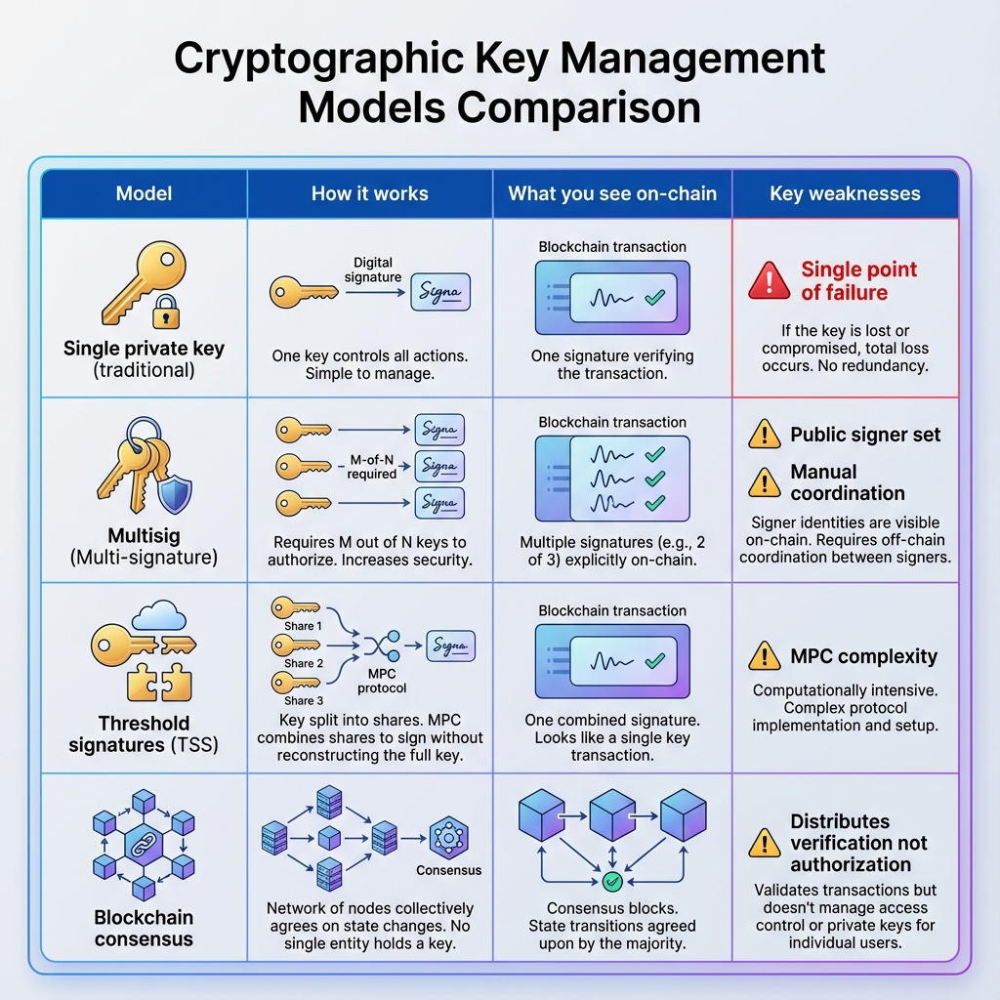

## What Exactly Are Threshold Signatures?

Alright, let's get into the actual mechanics here. Don't worry, we'll keep this grounded.

In traditional cryptography, signing something (authorizing a transaction, unlocking a vault, whatever) requires a private key. One key, held by one entity. That entity uses their key to create a digital signature that proves they authorized something. This works great until that entity becomes a problem: they get hacked, they go rogue, their laptop dies, or they just forget their password like a normal human being.

Threshold Signature Schemes (TSS) take a completely different approach. Instead of one person holding one complete key, TSS mathematically divides that key into multiple "key shares" and distributes them among different participants. In blockchain land, we call these participants "nodes." In pure cryptography, they're "signers." Either way, the concept is identical.

Now, the important thing to note here is that no single participant ever possesses the complete key. Not during setup, not during operation, not even temporarily in computer memory. The complete key doesn't exist anywhere. It's distributed across multiple parties in such a way that they can collectively use it without any individual having complete control.

Think about that for a second. The key literally doesn't exist in any one place. You can't steal it because there's nothing to steal. You can't lose it because there's nothing to lose. The power is distributed at the foundational level, not just the organizational level.

### Comparing Key Management Models

To better understand how threshold signatures differ from other approaches, let's look at the key management landscape:

As you can see from this comparison, threshold signatures offer a unique balance: they provide the security benefits of distributed key management (like multisig) while maintaining the simplicity and efficiency of a single signature on-chain. Unlike multisig, where everyone can see your signer set and threshold, TSS keeps that information private. And unlike blockchain consensus, which distributes verification but not authorization, TSS actually distributes the authorization power itself.

