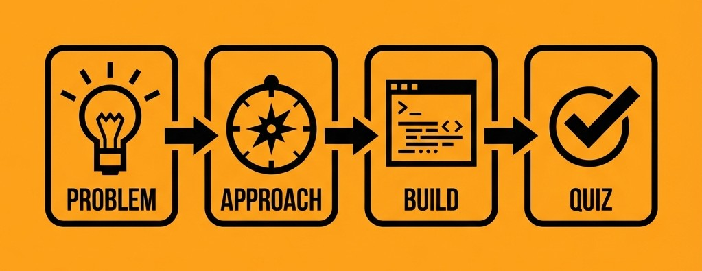

# How to Approach This (Or: Please Don't Skip This, We Promise It's Not Boring)

Look, we get it. You're a builder. You want to jump straight into the code. Reading "how to use this guide" feels about as exciting as reading the terms and conditions before downloading an app. But hear us out for like 2 minutes, because we actually put some thought into how this whole thing is structured, and it might save you from rage-quitting later.

---

## The Philosophy (Yes, We Have One)

Most tutorials suck in one of two ways:

There's the "wall of theory" approach where you read 47 pages about cryptographic primitives before you write a single line of code. By page 12, you're questioning your life choices.

Then there's the "just copy-paste this" approach. Code dumps with zero context. Works great until something breaks and you're sitting there like "I have no idea what any of this does because I was basically a human Ctrl+C, Ctrl+V machine."

We're trying something different. Each example teaches one concept at a time...no drinking from the firehose. We introduce primitives individually, show you how they work, then show you how they compose into bigger things. Theory gets sprinkled in where it actually matters, not dumped upfront.

And honestly... We're trying to make this fun. Not in a "fellow kids" cringe way, but in a "this is actually interesting and we're not going to bore you to death" way. If you're not at least mildly entertained, we've failed.

---

## How We Structured This

Think of this like a video game progression system, except instead of unlocking new skins, you're unlocking the ability to build applications that were literally impossible before. Cool trade-off, right?

We start with the "what" and "why" of dcipher. What are these three primitives everyone keeps talking about? Why do they matter? What problems do they actually solve? This is the only part where we get a bit theoretical, but we keep it snappy. No 50-page whitepapers, promise.

Then we jump into building with randomness. First you'll build a dice roller, then a lottery, then NFTs with unpredictable traits. Each one builds on the last, so by the end you're not just copy-pasting....you actually get the pattern.

After that we get into the spicy stuff: blocklock encryption. Time-locked messages, sealed-bid auctions...the kind of things that make you go "wait, you can DO that on-chain?" Turns out, yeah. You can.

Final boss is cross-chain swaps. Multi-chain applications that don't need bridges or wrapped tokens. If you make it here, you're officially dangerous.

### What to Expect in Each Example

Every example follows the same flow. We start with the problem...what are we trying to solve? Why does it matter? Then we show you the approach: how does dcipher help? What primitives are we using?

Then comes the actual build. Code, walkthroughs, explanations that don't assume you have a PhD in cryptography. We walk through it step by step.

At the end, there's a checkpoint quiz to make sure you actually absorbed something. Don't worry, they're not evil. Just enough to confirm you weren't scrolling on autopilot.

Most examples (from 3 to 12) also have hands-on coding sections. These are the ones where you actually build something yourself, deploy it, and submit your GitHub repo. More on that in Part 3.

---

## What We Assume You Know

Let's set expectations:

You can write Solidity. Not asking for expert-level, but you should know what a function is and not be scared of modifiers.

You've deployed a contract before. Remix, Hardhat, Foundry, whatever. You've seen the process.

You understand basic blockchain stuff. Blocks, transactions, gas, wallets. The fundamentals.

You don't need to know cryptography. Seriously. Zero. We'll explain what you need when you need it.

Multi-chain experience is helpful but not required. We'll walk you through it.

---

## How to Actually Use This

Here's the game plan:

Read sequentially, at least for the first few examples. We build concepts on top of each other, so skipping around early on is like trying to watch Endgame without seeing the other Marvel movies. Technically possible, but you'll be confused.

Do the hands-on examples. Don't just read them. Actually build them. Deploy them. Break them. Fix them. That's where the learning happens.

Take the quizzes seriously. They're not there to torture you. They're checkpoints to make sure you're not just nodding along while secretly having no idea what's happening.

And if you're stuck? Confused? Something doesn't make sense? That's on us, not you. Reach out. We want to make this better.

---

## A Quick Pep Talk

If you're here, you probably fall into one of two camps. Either you heard about dcipher and you're curious what the hype is about, or you've been trying to build something and you keep hitting walls that shouldn't exist.

Maybe you wanted to build a fair lottery but couldn't figure out how to get actual randomness. Maybe you wanted sealed bids but everything on-chain is public. Maybe you're tired of bridge exploits and you're wondering if there's a better way to do cross-chain stuff.

We built this guide because we were frustrated too. Blockchains are incredible, but they have these massive gaps that make entire categories of applications impossible. dcipher fills those gaps.

This guide is here to show you how to actually use it. Not in a "read the docs and figure it out" way. More like a "let's build something cool together and I'll explain things as we go" way.

So grab some coffee. Or tea. Or whatever gets you through coding sessions. And let's turn those shelved ideas into actual working applications.

Ready? Let's go. 🚀
